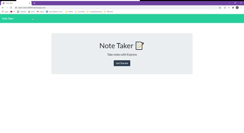

# Note Taker
  A simple note taking application that allows the user to create, view, and delete notes.
   
  https://warm-sierra-60665.herokuapp.com/
  ## Table of Contents
  * [Demo](#demo)
  * [Installation](#installation)
  * [Developer's Information](#devInfo)
  * [Credientials](#credientials)
  * [License](#license)
  
  ## Demo
  The user is presented with an initial page and is prompted to get started. Once the button is clicked, the user may view old notes, create new notes, and delete notes.

  
  ## Installation
  The live application requires no downloads. To run the application locally, node.js must be installed. The user will download node modules by running 'npm install' inside of the main folder's integrated terminal.
  ## Developer's Information
  Feel free to contact me using the information below if you have any questions or feedback!
   
  Name: Jacob Beeson
   
  Github Link: <jpbeeson>
   
  Email: <beeson.jp@gmail.com>
  ## Credientials
  Websites utilized for help and information:

  https://nodejs.org/api/documentation.html

  https://developer.mozilla.org/en-US/docs/Web/JavaScript/Reference/Global_Objects/Array/filter

  https://api.jquery.com/

  https://expressjs.com/en/guide/writing-middleware.html

  https://expressjs.com/en/4x/api.html#express

  https://stackoverflow.com/questions/42517721/difference-between-and#:~:text=%3D%3D%3D%20

  https://www.youtube.com/c/WebDevSimplified/featured
  ## License
  MIT License

  Copyright (c) [year] [fullname]

  Permission is hereby granted, free of charge, to any person obtaining a copy
  of this software and associated documentation files (the "Software"), to deal
  in the Software without restriction, including without limitation the rights
  to use, copy, modify, merge, publish, distribute, sublicense, and/or sell
  copies of the Software, and to permit persons to whom the Software is
  furnished to do so, subject to the following conditions:

  The above copyright notice and this permission notice shall be included in all
  copies or substantial portions of the Software.

  THE SOFTWARE IS PROVIDED "AS IS", WITHOUT WARRANTY OF ANY KIND, EXPRESS OR
  IMPLIED, INCLUDING BUT NOT LIMITED TO THE WARRANTIES OF MERCHANTABILITY,
  FITNESS FOR A PARTICULAR PURPOSE AND NONINFRINGEMENT. IN NO EVENT SHALL THE
  AUTHORS OR COPYRIGHT HOLDERS BE LIABLE FOR ANY CLAIM, DAMAGES OR OTHER
  LIABILITY, WHETHER IN AN ACTION OF CONTRACT, TORT OR OTHERWISE, ARISING FROM,
  OUT OF OR IN CONNECTION WITH THE SOFTWARE OR THE USE OR OTHER DEALINGS IN THE
  SOFTWARE.
  
